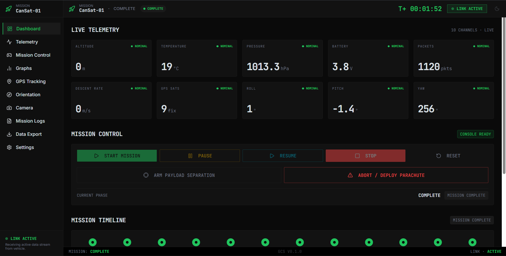
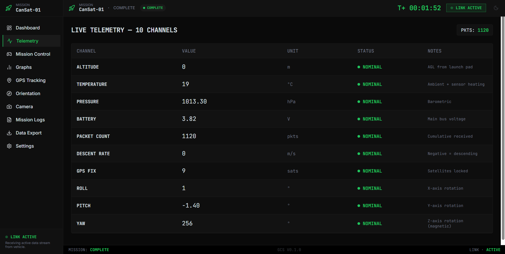
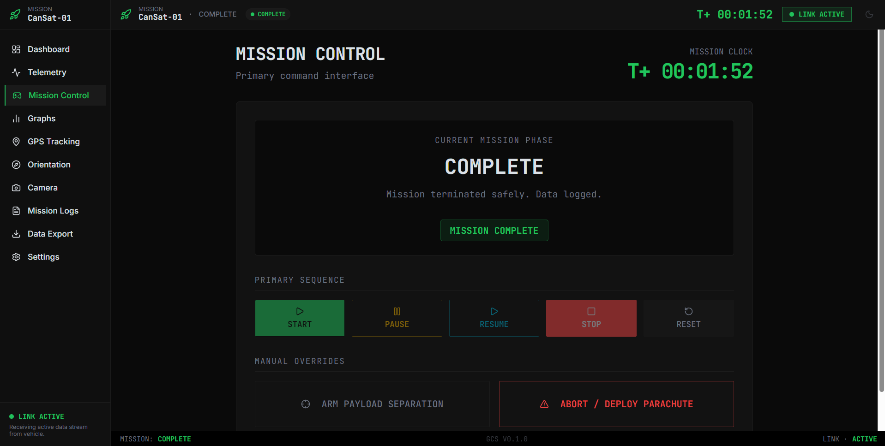
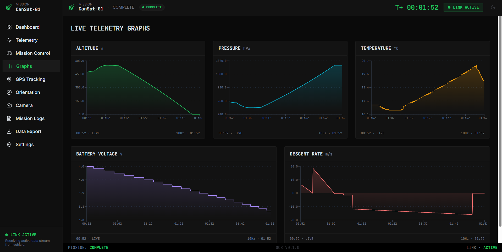
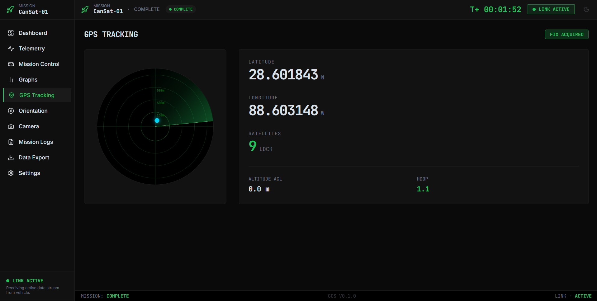
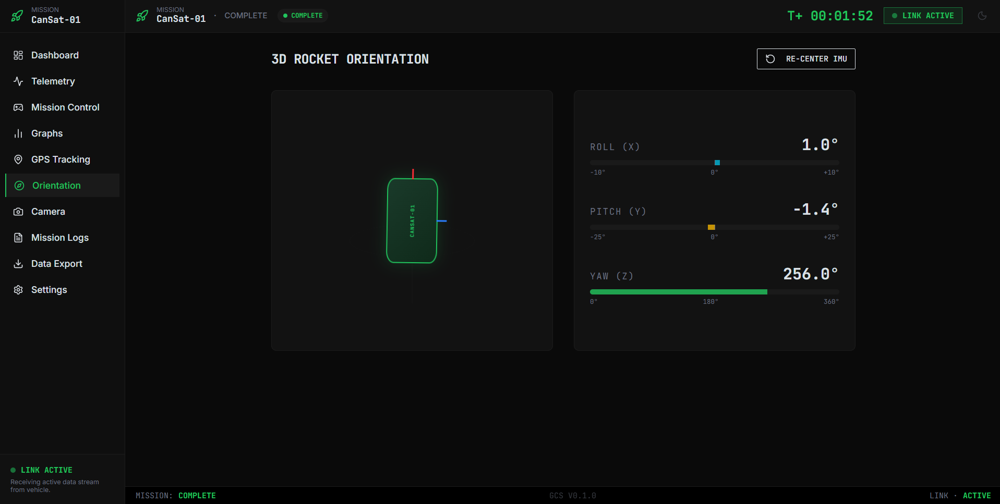
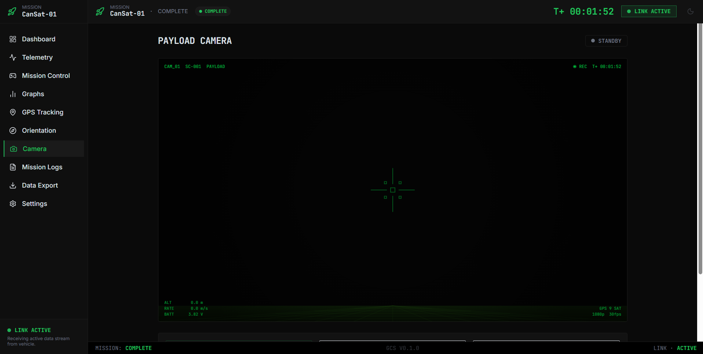
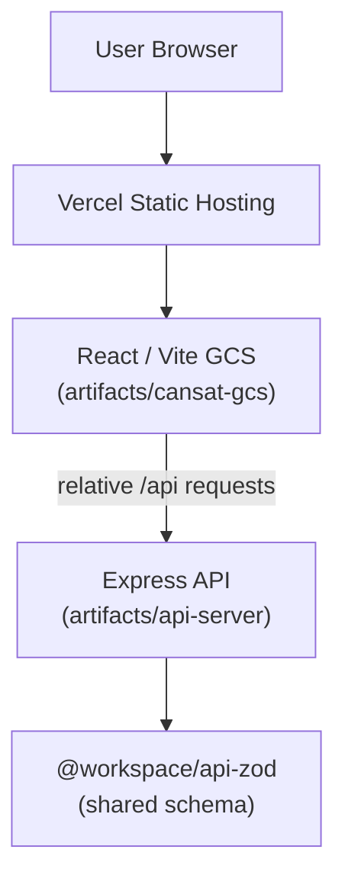

# CanSat Ground Control Station

A web-based Ground Control Station (GCS) interface for monitoring and operating a simulated CanSat mission. It provides a full mission-ops dashboard — live telemetry, GPS tracking, orientation, mission logging, and data export — built as a portfolio-grade simulation of real CanSat ground segment software.


## 🚀 Live Demo

**Live app:** https://cansat-ground-control-station.vercel.app/
**Repository:** https://github.com/harshsatyarthi-bit/CanSat-Ground-Control-Station

## 📸 Screenshots

### Dashboard


### Live Telemetry


### Mission Control


### Telemetry Graphs


### GPS Tracking


### Orientation


### Payload Camera



## ✨ Features

- **Dashboard** — Consolidated mission overview: live telemetry snapshot, mission control status, mission timeline, and vehicle health.
- **Live Telemetry** — 10-channel real-time telemetry readout.
- **Mission Control** — Mission phase tracking and control actions.
- **Graphs** — Live-updating telemetry graphs for trend analysis.
- **GPS Tracking** — Live map/radar-style position tracking with animated vehicle position.
- **Orientation** — Real-time attitude visualization with IMU re-center control.
- **Payload Camera** — Simulated payload camera feed rendered on canvas (not a live hardware video feed).
- **Mission Logs** — Timestamped, severity-tagged event log of mission activity.
- **Data Export** — Export telemetry as CSV or mission logs as JSON, downloaded through a two-step server-backed flow (not a browser blob URL).
- **Settings** — System-level configuration for the GCS session.

## 🛰️ Ground Control Station Capabilities

The GCS models the software an operator would use to run a CanSat mission from the ground:

- **Situational awareness** — the Dashboard and Telemetry views surface the vehicle's live state (10 telemetry channels) at a glance and in detail.
- **Trend analysis** — the Graphs view plots telemetry over time so an operator can spot drift or anomalies rather than reading raw numbers.
- **Spatial tracking** — GPS Tracking and Orientation reconstruct where the vehicle is and how it's oriented, including a manual IMU re-center command.
- **Mission bookkeeping** — Mission Control tracks mission phase, and Mission Logs keeps a severity-tagged audit trail of every event.
- **Data handoff** — Data Export lets an operator pull telemetry/log data out of the session as CSV or JSON for post-mission analysis, via a small Express API rather than client-side-only blob downloads (chosen specifically because blob-URL downloads get flagged by some endpoint-security software).

All mission data in the current build is generated by an in-browser simulation engine (`src/lib/simulation.ts`) rather than a live hardware link — see [Future Improvements](#-future-improvements).

## 🏗️ Project Architecture

This is a **pnpm monorepo** with workspace packages linked via `workspace:*`:

| Path | Role |
|---|---|
| `artifacts/cansat-gcs` | React + TypeScript + Vite frontend — the GCS UI itself |
| `artifacts/api-server` | Express API used by the Data Export flow (`/api/healthz`, `/api/export/*`) |
| `lib/api-client-react` | Shared workspace package referenced by the frontend project |
| `lib/api-zod` | Shared Zod schema (e.g. the health-check response shape) used by the API server |
| `lib/db` | Shared workspace package/project reference for the API server; not currently used by any live route |
| `pnpm-workspace.yaml` | Workspace package list, shared dependency version catalog, and platform-specific install overrides |
| `vercel.json` | Vercel build configuration for deploying the frontend as a static site |



The frontend talks to the API only for the Data Export feature, using relative `/api` requests. The API server is not currently deployed alongside the frontend on Vercel — see [Deployment](#-deployment).

## 🛠️ Tech Stack

**Frontend**
- React 19, TypeScript 5.9, Vite 7
- Wouter (routing), Zustand (state), TanStack React Query
- Recharts (graphs)

**Backend**
- Express 5, Node.js
- Pino / pino-http (structured logging)

**UI / Styling**
- Tailwind CSS 4, Radix UI primitives, shadcn-style component layer, Lucide icons, Framer Motion

**Build / Tooling**
- Vite, esbuild (API server bundling), TypeScript project references

**Package Management**
- pnpm workspaces with a shared version catalog (`pnpm-workspace.yaml`)

## 📁 Project Structure

```text
.
├── artifacts/
│   ├── cansat-gcs/          # React/Vite frontend
│   │   └── src/
│   │       ├── pages/       # Dashboard, Telemetry, MissionControl, Graphs, GPSTracking,
│   │       │                # Orientation, Camera, MissionLogs, DataExport, Settings
│   │       ├── components/  # Layout + UI component library
│   │       ├── store/        # Zustand mission store
│   │       └── lib/          # Simulation engine, formatting, types, utils
│   └── api-server/          # Express API
│       └── src/
│           ├── routes/       # health.ts, export.ts
│           └── app.ts
├── lib/
│   ├── api-client-react/
│   ├── api-zod/
│   └── db/
├── pnpm-workspace.yaml
├── vercel.json
├── tsconfig.base.json
└── tsconfig.json
```

## ⚙️ Local Development

Requirements: Node.js 20+, pnpm 9+

```bash
# 1. Clone the repository
git clone https://github.com/harshsatyarthi-bit/CanSat-Ground-Control-Station.git
cd CanSat-Ground-Control-Station

# 2. Install dependencies
pnpm install

# 3. Start the frontend dev server
PORT=19737 BASE_PATH=/ pnpm --filter @workspace/cansat-gcs run dev

# In a second terminal, start the API server (needed for Data Export)
PORT=8080 NODE_ENV=development pnpm --filter @workspace/api-server run dev

# 4. Build the production frontend
pnpm install --frozen-lockfile
PORT=19737 BASE_PATH=/ pnpm --filter @workspace/cansat-gcs run build
```

The production frontend build outputs to `artifacts/cansat-gcs/dist/public`.

## 🚀 Deployment

The frontend is deployed on **Vercel** as a static build, using the build command and output directory defined in `vercel.json`.

The Express API server is **not** currently deployed alongside it. Because Data Export calls `/api/healthz`, `POST /api/export/prepare`, and `GET /api/export/file`, that feature will not work in production until the API server is hosted separately (or routed through the same domain via a rewrite/reverse proxy) and the frontend's `/api` requests are pointed at it.

## 🔌 API

A small Express API backs one feature — Data Export:

- `GET /api/healthz` — health check
- `POST /api/export/prepare` — accepts a CSV or JSON payload, stores it server-side under a short-lived, one-time token
- `GET /api/export/file?token=<uuid>` — returns the prepared file as a real HTTP download (`Content-Disposition: attachment`)

This two-step flow is used instead of a client-side blob URL specifically because blob downloads are sometimes flagged by endpoint-security software.

## 🔐 Environment Variables

**Frontend (build/dev):**
- `PORT` — required by the existing Vite configuration
- `BASE_PATH` — required by the existing Vite configuration (`/` for a root deployment)

**API server:**
- `PORT` — required listening port
- `NODE_ENV` — controls production/development logging
- `LOG_LEVEL` — optional logging level

No environment variables are currently required to build or deploy the static frontend to Vercel beyond `PORT` and `BASE_PATH`, which are already set in the Vercel build command. No secrets, API keys, or database connection strings are required by the current codebase.

## 🧪 Build & Verification

This project has been verified with:

```bash
pnpm install --frozen-lockfile
pnpm build
```

Both the API server (esbuild bundle) and the frontend (Vite production build, output to `artifacts/cansat-gcs/dist/public`) build successfully.

## 🔮 Future Improvements

These are ideas for future work — none of the following are implemented in the current build:

- Live hardware telemetry integration (real CanSat downlink)
- WebSocket-based telemetry streaming instead of in-browser simulation
- Persistent telemetry storage (the `lib/db` package exists as a workspace reference but is not wired into any route yet)
- Deploying the API server alongside the frontend for a fully working Data Export in production
- Authentication for mission operators
- Additional mission analytics and post-flight reporting
- Improved/additional export formats

## 👨‍💻 Author

**Harsh Satyarthi**
B.Tech — Electronics & Communication Engineering (IoT)
GitHub: [https://github.com/harshsatyarthi-bit](https://github.com/harshsatyarthi-bit)

## 📄 License

This repository does not currently specify a license.
